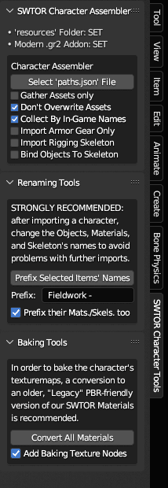
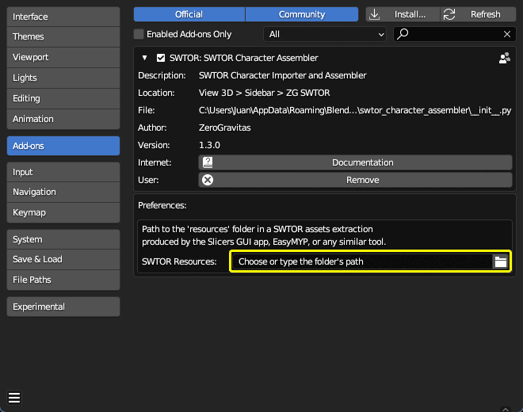
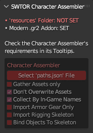
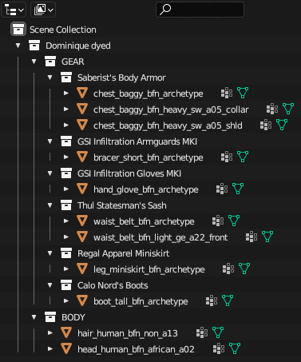
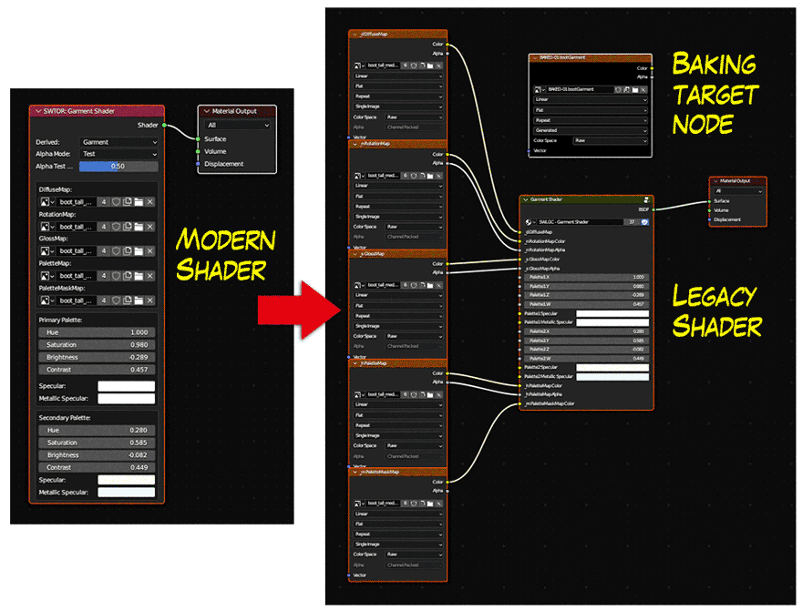

# SWTOR Character Assembler

**This Blender Addon allows for the processing of [TORCommunity.com's Character Designer](https://github.com/SWTOR-Slicers/WikiPedia/wiki/Using-TORCommunity-Character-Designer)'s .zipped SWTOR characters folders directly from Blender.**

**It combines the previous two-steps functionality of the [Slicers GUI Tool](https://github.com/SWTOR-Slicers/Slicers-GUI)'s Locate feature and the [.gr2 Importer Addon](https://github.com/SWTOR-Slicers/Granny2-Plug-In-Blender-2.8x)'s Character Importer as an automated one-button process. It also comes with a quick Objects / Materials / Collections prefixer to be able to do multiple imports in a single Blender project, and with a Materials converter to facilitate baking operations for exporting SWTOR characters to other apps.**

It should be noted that this Add-on's tools exist in the **[ZeroGravitas (ZG) SWTOR Tools Add-on](https://github.com/SWTOR-Slicers/ZG-SWTOR-Tools)**, too (that one is kind of an "all-in-one" add-on).

## **[Download the Addon's latest release](https://github.com/SWTOR-Slicers/SWTOR-Character-Locator/releases/latest)**

## Requirements:
* **An enabled ["Modern" .gr2 Importer Addon](https://github.com/SWTOR-Slicers/Granny2-Plug-In-Blender-2.8x)**, as this one calls it to execute the actual character importing and assembling.
* **A SWTOR assets extraction** performed via Slicers GUI (with either the "Dynamic" or "All" presets) or EasyMYP.
* **TORCommunity.com's Character Designer-exported (unzipped) folders**, or non-Creature-type NPCs ones exported from its NPC database (which is down at the moment, sadly 🙁. We keep a stash of those in our Discord server, though).  
* **THERE'S NO NEED TO PROCESS THE FOLDERS WITH THE SLICERS GUI'S LOCATE FEATURE**. It's the whole point of this new Addon 🙂.
## Features
The SWTOR Character Assembler:
* Fills a Player Character/NPC's folder (exported by TORCommunity.com's Character Designer or NPC database) with all the game assets required for assembling them in Blender.  
  **It gathers the character or NPC's skeleton rig**, saving it inside a "skeleton" folder next to "models" and "materials".

  It solves some long lingering issues, such as placing the typically **missing "black.dds" texturemap** in our SWTOR asset extractions if absent.  

  It also gathers some maps that weren't being covered by Slicers GUI:
  * **DirectionMaps**, that can be used by the Creature, SkinB, and HairC Shaders to produce anisotropic-like speculars.
  * **WrinklesMaps**, meant to be used in heads' SkinB Shaders to animate facial wrinkles. Our version of the shader doesn't support them yet, but some experiments are being carried in order to implement their use).

* Under the hood, the Addon calls Darth Atroxa's .gr2 Importer Addon's Character Import feature to assemble the character. It should be pointed out that this means this Addon has the same limitations regarding Creature-type (single mesh) NPCs, and some bugs importing body and armor parts with two materials, such as underwear ones (the latter seems to be solved and is waiting for a revision before release).

* **It reports its progress and errors through Blender's Console**. It is recommended to keep it open to check for any error message, as it lists all the files it detects and copies, showing if any entry is malformed or leads to an inexistent file.

* It adds a series of "quality of life" options to the process, such as collecting armor parts by their in-game names.

* Also, it comes with an **Items Prefixer**: it allows for adding a prefix to any item selected in the 3D View or the Outliner, including any Collections. What's more, it's smart enough to prefix any selected object's materials without needing to explicitly select them, too, plus any skeleton's internal data-block. Doing this to the results of a character import lets us make all those names unique enough **to be able to import several characters to the same Blender project** (for example, different sets of armor) without making an utter mess of their materials.  
  
  (If our renaming needs are more complex than that, then it's Blender's own Batch Renaming tool's turn. Just remember that it is crucial that the Materials are renamed, too, not just the objects)

* Finally, **it includes a Material converter to help baking the character's textures** into something we can export to other apps.
  
  The SWTOR shaders from the modern version of the .gr2 Importer Addon are quite faithful to the game's ones, but to achieve that they reproduce the way SWTOR calculates certain material attributes, which doesn't work well with Blender's baking workflow.

  The older, "Legacy" version of the shaders wasn't as good, but happened to be more baking-friendly. So, we've included this simple converter: it converts every material in the Blender project that uses any of the basic SWTOR shaders (Uber, Creature, Garment, SkinB, Eye, HairC), and adds a texturemap node set as the Active node in the material, with a preloaded blank image, set to the resolution of the material's diffuse map. With such setup, one can just select the character's objects, set the baking parameters, and fire it up.

  It should be pointed out that this conversion works for any type of SWTOR objects, not just character ones. On the other hand, there are some other SWTOR shaders that we've added rather recently, such as AnimatedUV, that aren't covered yet.
  

## Importing options
The Addon's importing options are:
* **Gather Assets Only**: it only locates and copies the asset files to the character folder, without importing them.
* **Don't Overwrite Assets**: if a located asset already exists in the folder, it preserves it instead of overwriting it. Useful if the files in the folder have been modified in some manner, such as retouching a texture, without changing the name (you *should* change the name when doing something like that).
* **Collect By In-Game Name**: it places each armor part's objects inside a Collection named after the armor's in-game name (say, "Canderous Ordo's Vest"). It does that by finding a `presets.json` file inside the character's folder. If unchecked, it just places all the objects in a common Collection named after the character folder's name.
* **Import Armor Gear Only**: discards the non armor-body parts of the character, expediting the creation of multiple sets of armor for a same character.
* **Import Rigging Skeleton**: imports the character's skeleton, without binding the character's objects to it.
* **Bind Objects To Skeleton**: binds the character's objects to the imported skeleton.

## Installation
The installation process is the typical for any standard Blender Addon: in Preferences > Add-Ons, install the Addon's .zip file, and then enable it by ticking its checkbox. The Addon will be available in the 3D Viewport's Sidebar as a "SWTOR Character Tools" tab.

In order to work, it requires us to set the path to a SWTOR assets extraction's `resources` folder. We do that in its Preferences panel.

If not set, the Addon's Status information will tell us what is missing, and set the affected tools to red. Generally, the tools' tooltips will explain what they do and what their requisites are.

## Operation

Instead of selecting a character's whole folder, as we do with the Slicers GUI tool when we want to locate its assets and fill it with them, we have to **select the "path.json" file inside the folder**, instead. Processing the file is nearly instantaneous.

With the default settings, the results are somewhat tidier than the plain .gr2 Importer Addon's, as this one is able to read the TORCommunity.com Character Designer preset stored in the folder (the "IMPORT_THIS.json" one, actually), which happens to hold the in-game names of the armor gear. This is an example of those results:

As for the Material converter, this is an example of what happens when applied. The modern SWTOR shader is converted to a Legacy version, and a image texturemap node is created alongside and set as the active node, so that it receives the texture baked for this material when the objects using it are selected and a bake is launched.

We recommend being careful when thinking about saving the project after doing the conversion. It's maybe better to do the baking on a duplicate, as the original modern materials will disappear after saving because of becoming unused ("zero users", in Blender parlance).

(The Legacy shaders that this Addon uses for the conversion are stored as a .blend file inside the Addon's folder. Those could be retouched manually, if you want to. As long as the names of the template materials, shader nodegroups, and their inputs, are preserved, the Converter tool will be able to deal with any changes to their internals)
