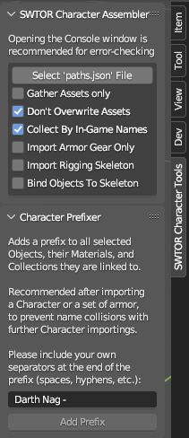
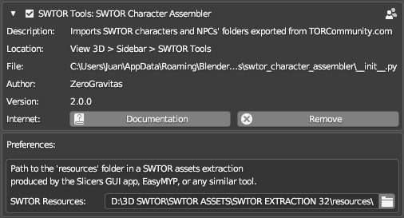

# SWTOR Character Assembler

**This Blender Addon combines the functionality of the [Slicers GUI Tool](https://github.com/SWTOR-Slicers/Slicers-GUI)'s Locate feature and the [.gr2 Importer Addon](https://github.com/SWTOR-Slicers/Granny2-Plug-In-Blender-2.8x)'s Character Importer as an automated one-button process. It also comes with a quick Objects/Materials/Collections prefixer to be able to do and organize multiple imports in a single Blender project.**

It requires:
* **An installed and enabled latest release of the [.gr2 Importer Addon](https://github.com/SWTOR-Slicers/Granny2-Plug-In-Blender-2.8x)**, as it relies on it for the actual importing into Blender.
* **A SWTOR assets extraction** performed via Slicers GUI (with either the "Dynamic" or "All" presets) or EasyMYP.
* **TORCommunity.com's Character Designer-exported (unzipped) folders**, or non-Creature-type NPCs ones exported from its NPC database (which is down at the moment, sadly 🙁).  
  **THERE'S NO NEED TO PROCESS THE FOLDERS WITH SLICERS GUI'S LOCATE FEATURE**. It's the whole point of this new Addon 🙂.

---
### **[Download the Addon's latest release](https://github.com/SWTOR-Slicers/SWTOR-Character-Locator/releases/latest)**
---

## Installation
The installation process is the typical for any standard Blender Addon. In order to work, it requires us to set the path to a SWTOR assets extraction's `resources` folder. We do that in its Preferences panel. If not set, the Addon's button will be greyed out.

The Addon appears in the 3D Viewport's Sidebar as a "SWTOR Character Tools" tab. Instead of selecting a character's whole folder as we do with the Slicers GUI tool, it needs us to select the "path.json" file inside, instead. Processing the file is nearly instantaneous.

## Features

The SWTOR Character Assembler:
* Fills a Player Character/NPC's folder (exported by TORCommunity.com's Character Designer or NPC database) with all the game assets required for assembling them in Blender.  
  **It gathers the character or NPC's skeleton rig**, saving it inside a "skeleton" folder next to "models" and "materials".

  It solves some long lingering issues, such as placing the typically **missing "black.dds" texturemap** in our SWTOR asset extractions if detected as missing.  
  It also gathers some maps that weren't being covered by Slicers GUI:
  * **DirectionMaps**, that can be used by the Creature, SkinB, and HairC Shaders to produce anisotropic-like speculars.
  * **WrinklesMaps**, meant to be used in heads' SkinB Shaders to animate facial wrinkles. Our version of the shader doesn't support them yet, but some experiments are being carried in order to implement their use).

* Under the hood, the Addon calls Darth Atroxa's .gr2 Importer Addon's Character Import feature to assemble the character. It should be pointed out that this means this Addon has the same limitations regarding Creature-type (single mesh) NPCs, and some bugs importing body and armor parts with two materials, such as underwear ones (the latter seems to be solved and is waiting for a revision before release).
* It adds a series of "quality of life" options to the process, such as collecting armor parts by their in-game names.
* Also, it comes with a **Character Prefixer**: it allows for adding a prefix not just to the names of a selection of objects but to their materials' names and the Collections holding them, with a single click. Doing this to the results of a character import lets us make all those names unique enough **to be able to import several characters to the same Blender project** (for example, different sets of armor) without making an utter mess of their materials.
* **It reports its progress and errors through Blender's Console**. It is recommended to keep it open to check for any error message, as it lists all the files it detects and copies, showing if any entry is malformed or leads to an inexistent file.

## Importing options
The Addon's importing options are:
* **Gather Assets Only**: it only locates and copies the asset files to the character folder, without importing them.
* **Don't Overwrite Assets**: if a located asset already exists in the folder, it preserves it instead of overwriting it. Useful if the files in the folder have been modified in some manner, such as retouching a texture, without changing the name (you *should* change the name when doing something like that).
* **Collect By In-Game Name**: it places each armor part's objects inside a Collection named after the armor's in-game name (say, "Canderous Ordo's Vest"). It does that by finding a `presets.json` file inside the character's folder. If unchecked, it just places all the objects in a common Collection named after the character folder's name.
* **Import Armor Gear Only**: discards the non armor-body parts of the character, expediting the creation of multiple sets of armor for a same character.
* **Import Rigging Skeleton**: imports the character's skeleton, without binding the character's objects to it. **WARNING: the .gr2 Importer Addon that this one uses under the hood isn't yet compatible with the skeletons of SWTOR 64 bit (released with the latest Game Update). So, for the time being, it's not recommended to use this option or the next one, unless we are working with assets extracted from SWTOR 32 bit (previous to the Game Update)**.
* **Bind Objects To Skeleton**: binds the character's objects to the imported skeleton.

